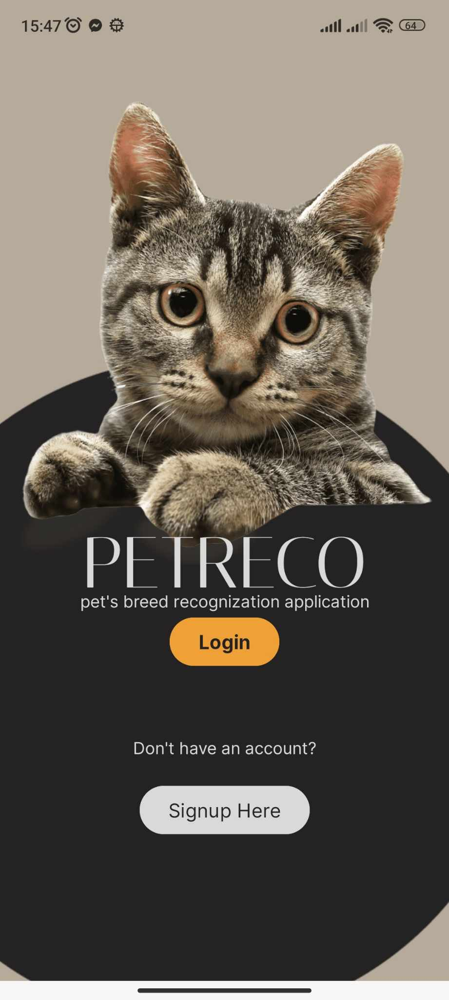
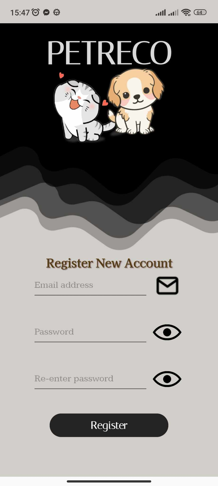
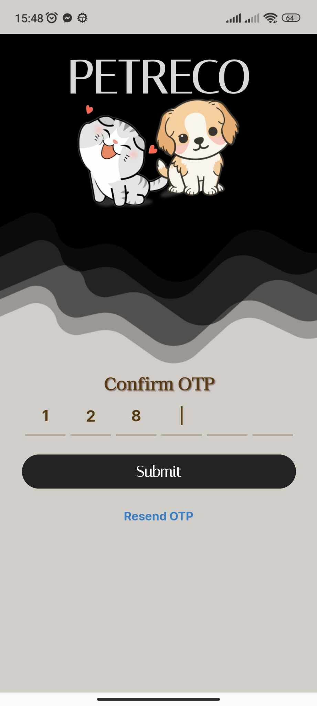
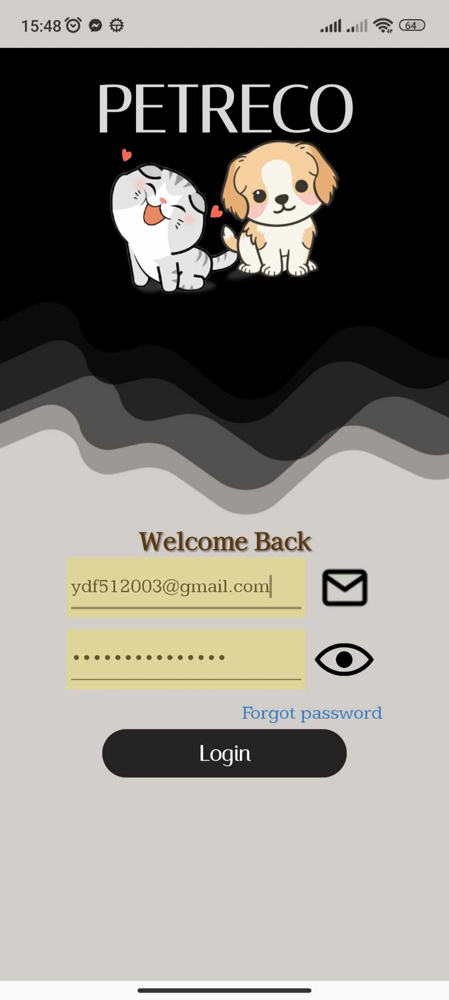

### Install Requirements
```
cd server
.venv\Scripts\activate
pip install -r requirements.txt
```

### Results
### 1. UIs
*Home page*


*Register page*


*OTP page*


*Login page*


### 2. Detection model


